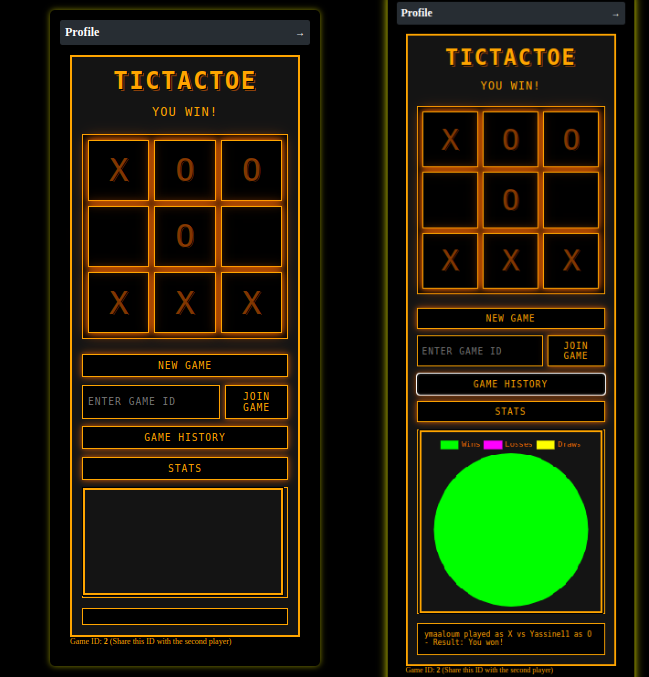

# ft_transcendence_42

## Description
**Transcendence** is a full-stack web application developed with **Django** for the backend and **HTML, CSS, JavaScript (Vanilla JS)** for the frontend. The project includes advanced features such as user management, multi-factor authentication, friend management, a real-time chat system, online games, and a tournament module.

## Technologies Used
### Backend
- **Django**: Web framework for user management and APIs
- **PostgreSQL**: Relational database for storing information
- **Redis**: Cache to improve performance
- **WebSockets**: Real-time communication for chat and games
- **JWT (JSON Web Token)**: Token-based authentication for secure API access

### Frontend
- **HTML, CSS, JavaScript (Vanilla JS)**: User interface
- **WebSockets**: Real-time communication
- **Single Page Application (SPA)**: The frontend uses the SPA concept to provide a smooth and dynamic experience without full page reloads.

### DevOps
- **Docker**: Application containerization
- **CI/CD**: Automated deployment
- **Nginx**: Web server for serving frontend files and handling requests
- **SSL (Secure Sockets Layer)**: Nginx is configured with SSL to secure communication between the client and server, ensuring data confidentiality and integrity.

## Features
### 1. User Management
- Standard sign-up and login
- Authentication via Google and Intra42
- Two-factor authentication (2FA)
- JWT-based authentication for API security
- User settings management (avatar update, personal information, enable/disable 2FA)

### 2. Friend Management
- Add/remove friends
- Block/unblock users

### 3. Chat System
- Real-time messaging via WebSockets
- Creation of private and public chat rooms

### 4. Online Games
- **Tic-Tac-Toe**: Multiplayer online mode via WebSockets
- **Ping-Pong**: Multiplayer online mode via WebSockets
- Local tournaments between multiple players

### 5. Infrastructure & Deployment
- **PostgreSQL** database
- **Redis** cache to enhance performance
- **Docker** for containerization and deployment
- **Nginx** for serving static files and frontend, configured with **SSL** to secure communication.

